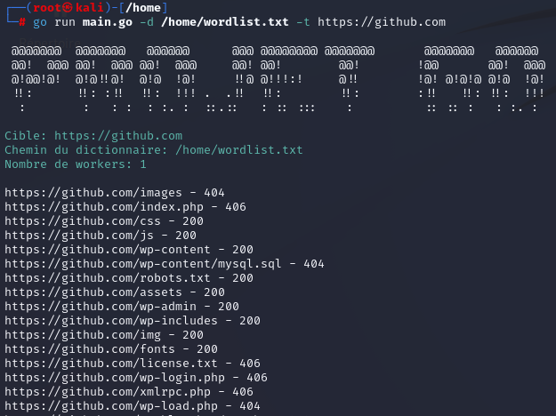
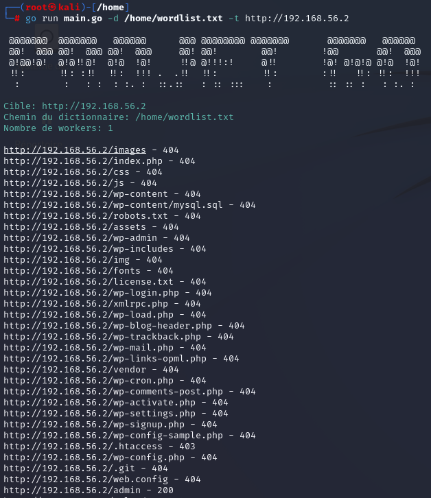
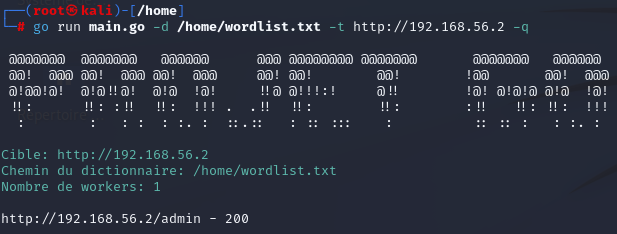
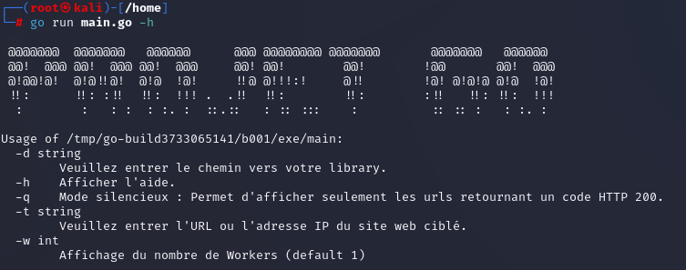

# Projet Go

Le but de ce projet va être de réaliser un programme similaire à gobuster. GoBuster est un outil
permettant d’identifier les fichiers et répertoires cachés sur un serveur web. Il fonctionne en
effectuant des requêtes HTTP sur un serveur web, en testant différentes URL et en analysant les
codes de réponse pour déterminer si les fichiers ou répertoires existent (HTTP 200, 301, 404 etc.).

# Getting Start :

Pour utiliser cet outil il faut :
  - Télécharger le script main.go ainsi que la library "wordlist.txt" et le mettre dans un répertoire.
  - Aller sur le répertoire et mettre les droits sur le fichier via la commande "chmod".
  - Utiliser la commande "go run main.go" ou "go build main.go" pour démarrer l'outil.

# Exemples :

# License :

Ce projet est sous la licence MIT, celle-ci est disponible dans les fichiers du répertoire [MIT License](./LICENSE.txt).

# Fonctionalités :

  - Un total de 1828 mots dans la Library !
  - Permet le Brute Force de répertoires/fichiers sur des serveurs webs.
  - Recherche à partir d'une adresse IP ou un URL.

  

  - Possède un Mode Silencieux permettant d'afficher que les codes HTTP 200.

  
  
  - Afficher la liste des options avec la commande '-h'.

  
